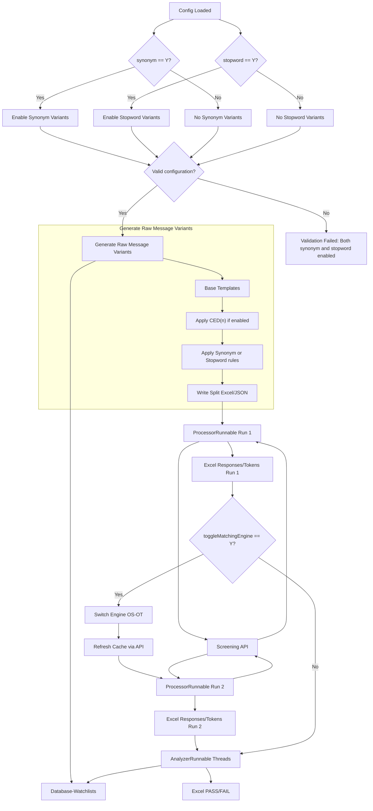

# Intelligent Raw Message Processor Utility v4.0

## Project Overview

This Java-based utility generates, processes, and analyzes raw financial messages for sanctions screening and compliance testing. It integrates with various watchlists to create message variants, posts them to a REST service for matching, and analyzes responses to identify true positives/negatives. Key features include:

- **Message Generation**: Queries watchlists from a database and generates variants using techniques like Character Edit Distance (CED), stopwords, and synonyms.
- **Message Processing**: Posts generated messages to a sanctions screening API, handles retries, and records responses.
- **Response Analysis**: Evaluates API responses against expected criteria, marking results as PASS/FAIL.
- **Matching Engine Toggling**: Optionally switches between Open Search (OS) and Oracle Text (OT) engines with cache refresh.
- **Concurrency**: Utilizes multi-threading for efficient processing and analysis.
- **Output**: Produces Excel files with detailed results, including inputs, responses, and test statuses.

This tool is designed for testing sanctions screening systems, ensuring accurate detection of compliance risks in financial messages.

## Architecture

The utility follows a modular, multi-threaded architecture:

1. **Configuration Loading**: Reads settings from `config.properties` and message templates from `source.json`.
2. **Raw Message Generation**: Queries database for watchlist data, generates variants, and writes to split Excel files.
3. **Processing**: Multi-threaded posting of messages to API, updating Excel with responses.
4. **Analysis**: Multi-threaded evaluation of matches, updating Excel with PASS/FAIL statuses.
5. **Optional Toggling**: Switches matching engines and refreshes caches via API calls.

### Conditional Flow Diagram (Feature Flags)

## Prerequisites

- **Java**: JDK 8 or higher.
- **Database**: Oracle Database with access to relevant watchlist data.
- **Libraries**:
  - Oracle JDBC drivers.
  - Apache POI for Excel manipulation.
  - SLF4J and Logback for logging.
  - Jackson for JSON processing.
  - OpenCSV for CSV handling.
  - Other dependencies (e.g., for HTTP requests and concurrency).
- **Configuration Files**: `config.properties` and `source.json` in the `bin/` directory.
- **Secure Connection Setup**: Requires configuration for secure database connections (details generalized for security).

Ensure API endpoints for token generation and message posting are accessible.

## Installation and Setup

1. **Configure Environment**:
   - Update `config.properties` with database settings, API endpoints, and feature flags.
   - Prepare `source.json` with message templates containing placeholders (e.g., `__TOKEN__`).
2. **Run the Utility**: Execute via `run.bat` or directly with `java -jar intelligent-raw-message-processor.jar`.

## Configuration Guide

The `config.properties` file controls the utility's behavior. Key sections include:

- **Feature Flags**: Enable/disable engine toggling (e.g., `toggleMatchingEngine=N`), variants like CED (`ced1=N`), stopwords (`stopword=N`), or synonyms (`synonym=Y`).
- **Database Settings**: JDBC driver, URL (generalized), and secure connection parameters.
- **Message Settings**: `tagName` for placeholder location, `webServiceId` (e.g., 1 for NameAndAddress), `watchListType` (e.g., COUNTRY).
- **API Settings**: Token URL, client credentials (redacted), retry flags, and posting endpoints.
- **Filters and Replacements**: SQL where clauses and placeholder mappings (e.g., `replace.src[0]=__IDENTIFIER__`, `replace.targetColumn[0]=N_UID`).

Refer to inline comments in `config.properties` for details. Note: Only one of stopwords or synonyms can be enabled at a time.

`source.json` provides the base message structure with placeholders for dynamic data insertion.

## Usage Instructions

1. **Prepare Configurations**: Edit `config.properties` and `source.json` as needed.
2. **Execute**:
   - Run the utility; it generates Excel files in `out/`.
   - Prompts for confirmation before processing.
   - Posts messages, analyzes responses, and updates Excel.
   - If toggling is enabled, repeats processing after engine switch.
3. **Output**: Excel files (e.g., `executing_1.xlsx`) with columns for sequences, rules, messages, tags, inputs, responses, match counts, statuses, and test results.
4. **Example**: For country synonym testing, set `watchListType=COUNTRY`, `synonym=Y`, `webServiceId=3`.

## Key Classes and Components

- **Main.java**: Entry point; manages overall flow, file cleanup, generation, multi-threaded processing/analysis, and optional toggling.
- **Constants.java**: Defines mappings for watchlists and web services, file paths, headers, and configuration keys.
- **RawMessageGenerator.java**: Handles database queries, variant generation (CED, stopwords, synonyms), and writing to split Excel/JSON files.
- **MessageProcessingUtility.java**: Manages API posting with retries, token handling, and updating Excel with responses.
- **MessageResponseAnalyzer.java**: Analyzes feedback for matches, computes PASS/FAIL, and updates Excel.
- **ToggleMatchingEngine.java**: Switches between OS/OT engines and refreshes caches via API.
- **SQLUtility.java**: Establishes secure database connections.
- **AnalyzerRunnable.java** and **ProcessorRunnable.java**: Implement threaded execution for analysis and processing.
- **SourceInputModel.java**: Data model for input messages.
- **logback.xml**: Configures logging levels and outputs.

## Troubleshooting

- **Connection Issues**: Verify database configuration and secure setup; check logs in `out/log/` for errors.
- **API Failures**: Ensure credentials and endpoints are correct; adjust retry settings for transient issues.
- **No Matches**: Validate `tagName`, `webServiceId`, and variant flags align with expectations.
- **Performance**: Tune thread counts (`processor_thread_count`, `analyzer_thread_count`) for large datasets.
- **Logs**: Enable debug in `logback.xml` for detailed tracing.

If problems persist, review logs for stack traces.

## Contributing/Extending

- Add watchlist types to `Constants.TABLE_WL_MAP`.
- Extend variant logic in `RawMessageGenerator` for custom rules.
- Contributions welcome; fork and submit pull requests.

For questions, contact the maintainer.
